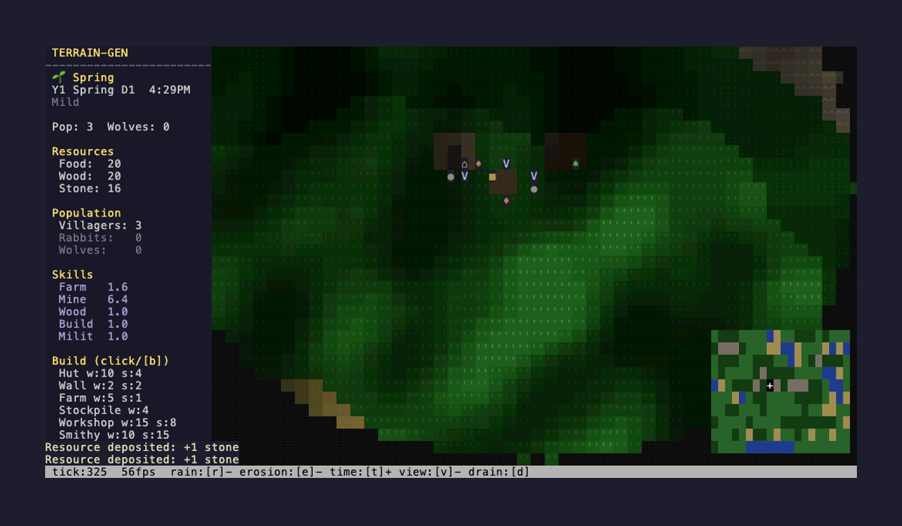
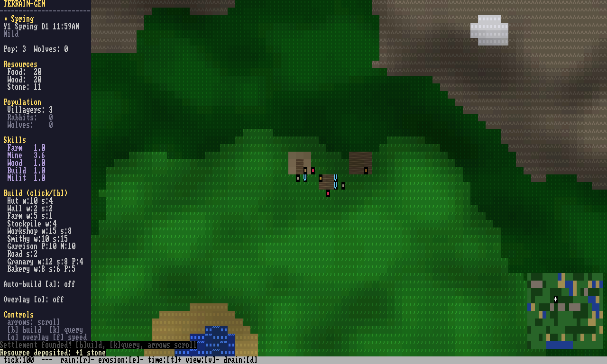
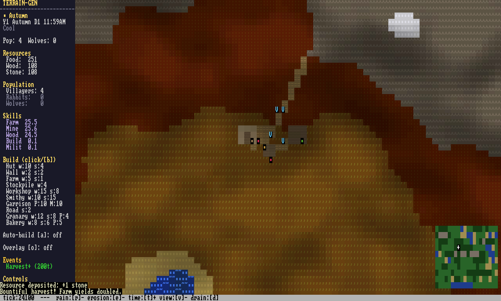
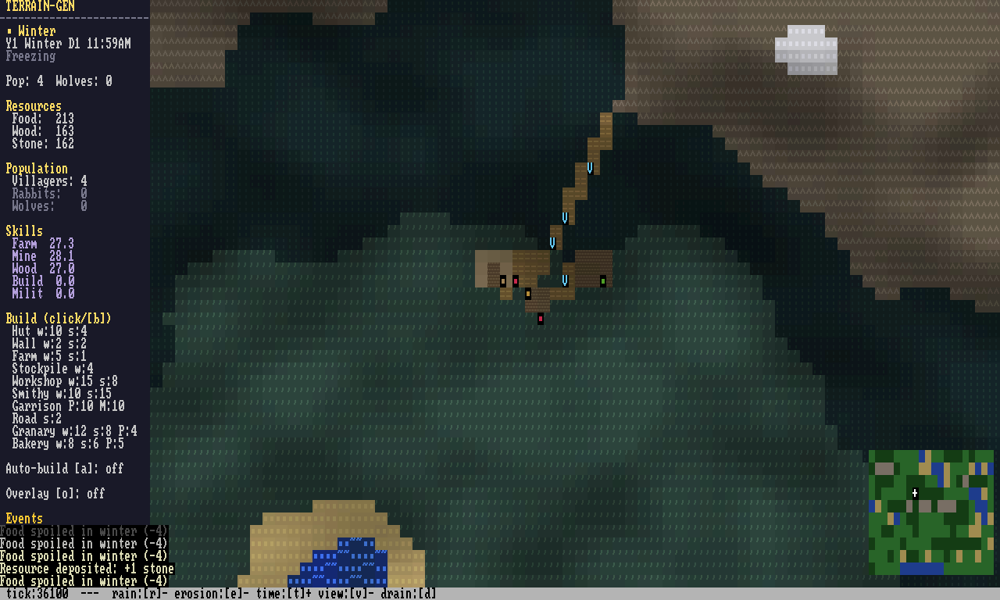
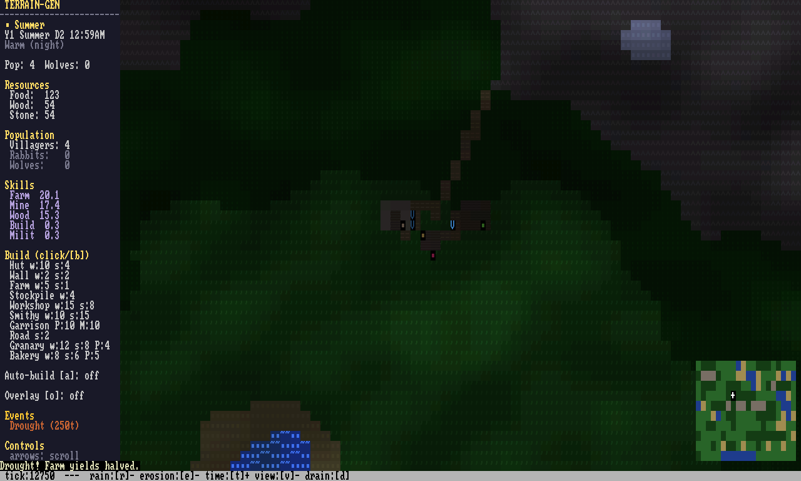

# terrain-gen-rust

A terminal-based settlement simulation with realistic terrain, hydraulic erosion, and autonomous villager AI — all rendered in your terminal with 24-bit color, Blinn-Phong lighting, and day/night cycles.




## Quick Start

```bash
cargo run --release                              # play the game
cargo run --release -- --showcase --seed 100      # terrain showcase (no entities)
cargo run --release -- --live-gen --seed 100       # watch erosion carve terrain in real time
```

## Screenshots

| Spring | Autumn |
|--------|--------|
|  |  |

| Winter | Moonlit Night |
|--------|---------------|
|  |  |

Generate screenshots: `./scripts/screenshots.sh` (requires `--features png`)

---

## System Architecture

### State-Driven Simulation

The simulation follows a strict state-driven architecture ([design doc](docs/design/cross_cutting/state_driven_architecture.md)):

> **State is truth. Systems create change. Derived data is a lens.**

All persistent simulation data lives in `WorldState`:

```
WorldState {
  heights       — terrain elevation (modified by erosion)
  water         — surface water depth (PipeWater, 8-directional flow)
  wind          — 2D velocity field + atmospheric moisture
  moisture      — soil moisture content
  vegetation    — plant density per tile
  hydro         — discharge + momentum fields (river locations + meandering)
}
```

Systems read state, compute deltas, and produce the next tick's state. Derived data (biomes, walkability, river graphs) is recomputed from state — never stored as truth.

### System Interaction Diagram

```
┌─────────────────────────────────────────────────────────────┐
│                     TERRAIN GENERATION                       │
│  Normalized noise (8-oct FBm) → Hydrology erosion (primary  │
│  shaper, Nick McDonald's SimpleHydrology) → Biome classify  │
│  → Soil assign → Resource placement                         │
└────────────────────────┬────────────────────────────────────┘
                         │ WorldState (heights, discharge, ...)
                         ▼
┌─────────────────────────────────────────────────────────────┐
│                     SIMULATION LOOP (per tick)                │
│                                                              │
│  ┌──────────┐  ┌──────────┐  ┌──────────┐  ┌────────────┐  │
│  │ Hydrology│  │ Wind +   │  │ Moisture │  │ Vegetation │  │
│  │ Erosion  │→ │ Curl     │→ │ + Ground │→ │ + Biome    │  │
│  │ (runtime)│  │ Noise    │  │ water    │  │ Reclassify │  │
│  └──────────┘  └──────────┘  └──────────┘  └────────────┘  │
│       │              │              │              │         │
│       ▼              ▼              ▼              ▼         │
│  ┌──────────────────────────────────────────────────────┐   │
│  │              PipeWater (8-dir flow)                    │   │
│  │  Ocean boundary → surface flow → evaporation          │   │
│  │  Discharge seeds river channels with actual water     │   │
│  └──────────────────────────────────────────────────────┘   │
│       │                                                      │
│       ▼                                                      │
│  Terrain::Water DERIVED from water depth every 20 ticks     │
│  (walkability, pathfinding, ice respond automatically)       │
│                                                              │
│  ┌──────────┐  ┌──────────┐  ┌──────────┐  ┌────────────┐  │
│  │ ECS AI   │  │ Path-    │  │ Events   │  │ Day/Night  │  │
│  │ (hecs)   │→ │ finding  │→ │ Seasons  │→ │ Lighting   │  │
│  │ Priority │  │ A* + Nav │  │ Weather  │  │ Blinn-Phong│  │
│  │ Queue    │  │ Graph    │  │ Ice/Flood│  │ Shadows    │  │
│  └──────────┘  └──────────┘  └──────────┘  └────────────┘  │
└─────────────────────────┬───────────────────────────────────┘
                          │
                          ▼
┌─────────────────────────────────────────────────────────────┐
│                      RENDERING                               │
│  Normal mode │ Landscape mode │ Map mode (half-block ▄)     │
│  + 11 diagnostic overlays (Height, Discharge, Moisture,     │
│    Slope, Wind, WindFlow, Tasks, Resources, Threats,        │
│    Traffic, Territory)                                       │
└─────────────────────────────────────────────────────────────┘
```

### Terrain Generation Pipeline

```
1. Normalized noise      8-octave FBm, [0,1] range
2. Hydrology erosion     Nick McDonald's SimpleHydrology (particle-based,
                         momentum-driven meandering, talus cascade)
                         Credit: github.com/weigert/SimpleHydrology
3. Water level           10th percentile of post-erosion heights
4. Biome classification  Whittaker rectangles (height × temp × moisture)
5. Soil assignment       Rocky > Sand > Peat > Alluvial > Clay > Loam
6. Resource placement    Geography-driven (no random spawning)
```

### Water System (Unified)

One rendering path for all water — ocean, rivers, rain, flooding:
- **PipeWater** depth is the single source of truth
- Ocean = boundary condition (constant depth at low-elevation edges)
- Rivers = discharge field seeds pipe_water depth in high-flow channels
- Rain → soil moisture → pipe_water overflow
- `water_visual()` renders everything from pipe_water.depth

### Wind System

Dual-model wind (switchable via config):
- **Curl Noise** (default): multi-octave Perlin noise, 2-layer timescales (synoptic + mesoscale), evolves every 20 ticks
- **Stam Fluids**: Jos Stam incompressible solver, static within season

Wind drives atmospheric moisture transport: ocean evaporation → wind advection → orographic precipitation → soil moisture.

---

## Design Philosophy

### The Ant Colony

The player sets direction, systems execute. No manual work assignments — villagers self-organize based on what's built.

- **Placement IS the instruction**: build a Farm → villagers farm. Build a Garrison → defense rises.
- **Overlays over UI**: press `o` to visualize any system
- **Roads auto-build** from foot traffic (300+ steps → Road)
- **No magical spawning**: resources discovered through exploration

### Five Design Pillars (ranked)

1. **Geography Shapes Everything** — terrain drives all decisions
2. **Emergent Complexity** — simple rules, complex behavior
3. **Threat Arc** — peaceful start → mounting challenges
4. **Observable Systems** — information through overlays, not menus
5. **Scale Gracefully** — 1000+ entities without lag

---

## Agent Harness & Evaluation

Built for AI-driven development — agents can play, evaluate, and improve the game.

### CLI Modes

```bash
cargo run --release -- --play --ticks 500              # headless play
cargo run --release -- --play --inputs "tick:100,ansi"  # ANSI frame capture
cargo run --release -- --showcase --seed 42             # terrain-only mode
cargo run --release -- --live-gen --seed 100            # watch erosion live
cargo run --release -- --diagnostics --seed 42          # JSON terrain stats
cargo run --release -- --report-card --seed 42          # narrative eval report
```

### Evaluation Infrastructure

```
scripts/
  capture_eval_frames.sh    — render PNGs for 3 seeds × 4 timepoints
  check_baselines.sh        — compare metrics against golden seeds
  record_metrics.sh         — append to metrics_history.json

tests/baselines/
  seed_42.json              — golden metric files
  seed_137.json
  seed_777.json
```

### Pipeline Health (pre-commit)

The `.git/hooks/pre-commit` hook auto-runs `pipeline_health` when terrain/render files change:
- Biome diversity (no single biome > 65% of land)
- Water coverage (3-50%)
- River coverage (< 30% of land)
- Coastal artifact detection (< 15% spike rate)

### Diagnostic Overlays

Press `o` to cycle: None → Tasks → Resources → Threats → Traffic → Territory → Wind → WindFlow → Height → Discharge → Moisture → Slope → None

---

## Controls

| Key | Action | Key | Action |
|-----|--------|-----|--------|
| Arrows | Scroll camera | `b` | Toggle build mode |
| `k` | Query/inspect tile | `o` | Cycle overlay |
| `f` | Cycle speed (1/2/5/20x) | `g` | Goto settlement |
| `r` | Cycle rain mode | `e` | Toggle erosion |
| `a` | Toggle auto-build | `Space` | Pause |
| `.` | Step one tick | `v` | Cycle render mode |
| `q` (x2) | Quit | `s`/`l` | Save/Load |

**Build mode**: `wasd` move cursor, `tab` cycle type, `enter` place, `x` demolish

---

## Module Map

```
src/
  main.rs                 — CLI, --play/--showcase/--live-gen/--diagnostics
  lib.rs                  — crate root
  world_state.rs          — WorldState: canonical simulation state struct
  hydrology.rs            — SimpleHydrology erosion (Nick McDonald port)
  analytical_erosion.rs   — SPL erosion (alternative, feature-flagged)
  terrain_pipeline.rs     — Worldgen orchestrator (noise → erosion → biomes)
  terrain_gen.rs          — Perlin fBm noise generation
  pipe_water.rs           — 8-directional surface water flow
  tilemap.rs              — TileMap, Terrain enum, A* pathfinding
  renderer.rs             — Renderer trait, Color, Cell
  crossterm_renderer.rs   — Terminal backend (24-bit color, double buffer)
  headless_renderer.rs    — In-memory renderer for testing/AI
  simulation/
    mod.rs                — SimConfig, WindModel, RainMode
    wind.rs               — Stam fluids + curl noise wind
    moisture.rs           — Soil moisture, precipitation, groundwater (Darcy)
    vegetation.rs         — Growth/decay, moisture-dependent
    day_night.rs          — Day/night, seasons, Blinn-Phong lighting
    water_map.rs          — Legacy water (being phased out)
    traffic.rs, scent.rs, soil_fertility.rs, maps.rs
  ecs/
    components.rs         — Position, Creature, BuildingType, etc.
    systems.rs            — AI, movement, hunger, death, farms, raids
    ai.rs                 — Priority-based task selection
    spatial.rs            — 16x16 spatial hash grid
    groups.rs             — Agent clustering
    spawn.rs, serialize.rs
  game/
    mod.rs                — Game struct, step(), ~780 tests
    water_cycle.rs        — Per-tick: wind → moisture → pipe_water → erosion
    render/               — Normal, Landscape, Map (half-block), Debug modes
    input.rs, build.rs, events.rs, fire.rs, particles.rs, save.rs
  pathfinding/
    region.rs, graph.rs, flow_field.rs — Hierarchical A*
  scripting/              — Lua integration (--features lua)
```

---

## Key Design Docs

| Doc | What |
|-----|------|
| `docs/BACKLOG.md` | **Start here.** Prioritized implementation backlog |
| `docs/design/cross_cutting/state_driven_architecture.md` | State vs derived vs systems |
| `docs/design/cross_cutting/nick_system_translation.md` | SimpleHydrology port guide |
| `docs/design/cross_cutting/nick_hydrology_integration.md` | Erosion-first pipeline design |
| `docs/design/cross_cutting/terrain_test_harness.md` | Automated visual QA |
| `docs/design/cross_cutting/automated_visual_qa.md` | Agent feedback loop design |
| `docs/game_design.md` | 5 pillars, success criteria, anti-goals |
| `docs/ARCHITECTURE.md` | File map, system health |
| `docs/workflow.md` | Dev pipeline, code review protocol |

## Research Library

| Doc | Topic |
|-----|-------|
| `docs/research/meandering_rivers_2023.md` | SimpleHydrology vs soillib comparison |
| `docs/research/soilmachine_deep_dive.md` | LayerMap, sediment, momentum |
| `docs/research/advanced_terrain_simulation.md` | SIGGRAPH papers, novel erosion |
| `docs/research/game_systems_survey.md` | AI, economy, pathfinding, narrative |
| `docs/research/terminal_visual_design.md` | ASCII rendering, Brogue/Cogmind techniques |
| `docs/research/terminal_terrain_rendering.md` | Half-block, color science, water effects |
| `docs/research/game_design_inspiration.md` | ONI, CK3, Caves of Qud, Cogmind UI |

---

## Testing

```bash
cargo test --lib           # ~780 tests (~25s)
cargo test                 # + integration tests
cargo test --features lua  # + Lua scripting tests
```

## Credits

- **Nick McDonald** — SimpleHydrology erosion system ([GitHub](https://github.com/weigert/SimpleHydrology), [Blog](https://nickmcd.me))
- **hecs** — ECS
- **crossterm** — Terminal rendering
- **noise** — Perlin noise
