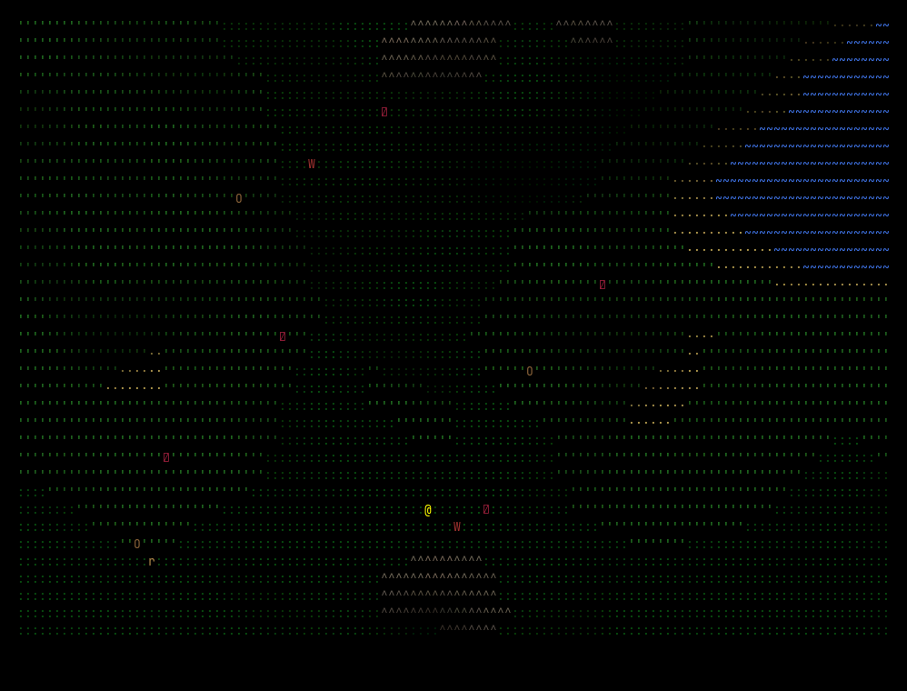

# terrain-gen-rust

Terminal-based civ/DF hybrid game built in Rust. Features procedural terrain, real-time water/erosion, day/night lighting, AI-driven ecosystem, and a settlement system with villager AI, building placement, seasons, and resource management.

Designed as an AI development harness: headless renderer, frame serialization, programmatic input injection, and 117+ automated tests enable rapid iteration with AI assistance.




## Features

**Terrain & Simulation**
- Procedural terrain via Perlin fBm — 8 terrain types (water, sand, grass, forest, mountain, snow, building floor/wall)
- Real-time water flow with gradient descent, evaporation, and pooling
- Hydraulic erosion simulation
- Moisture propagation and vegetation growth/decay
- Day/night cycle with Blinn-Phong lighting and shadow raytracing
- Seasonal calendar: Spring/Summer/Autumn/Winter affect rain, vegetation, hunger, and wolf behavior

**Settlement System**
- Villagers ('V') with utility-based AI: gather wood/stone, eat, build, flee wolves
- Resource tracking: Food, Wood, Stone with HUD display
- Build mode ('b'): place Huts, Walls, Farms with ghost preview and cost validation
- Buildings modify terrain — walls block movement and wolf entry
- Farms grow food seasonally with 4 visual growth stages
- Influence map creates organic, diffusion-based territory (blue tint)
- Population growth when food surplus and housing available

**Ecosystem AI**
- Prey (rabbits) seek berry bushes when hungry, eat, then flee home to dens
- Predators (wolves) hunt prey; attack villagers when desperate (winter)
- Seasonal breeding: prey at dens, wolves in open (Spring/Summer only)
- Population caps: 3 prey per den, 6 wolves max
- Hunger cycle drives behavior — creatures eat roughly once per in-game day
- Starvation kills creatures at hunger = 1.0

**Seasons**
- 10-day seasons, 40-day years (1 day = 1200 ticks)
- Spring: high vegetation growth, rain, animal breeding
- Summer: peak food, low rain, fast farm growth
- Autumn: vegetation decays, shorter days
- Winter: no growth, 1.8x hunger, wolves target villagers, farms dormant

**Engine**
- ECS architecture (hecs) with Position, Velocity, Sprite, Behavior, Creature components
- Grid-based collision with axis-separated wall sliding and bounce
- 2:1 aspect ratio correction for square-looking terminal tiles
- Double-buffered crossterm rendering at 60fps (hybrid sleep + spin-wait)
- Terminal resize handling

**AI Harness**
- Headless renderer for max-speed simulation and testing
- `Game::step()` / `Game::step_headless()` for single-tick advance
- `GameInput` enum decoupled from terminal input
- `run_script()` feeds action sequences, returns `FrameSnapshot` series
- `FrameSnapshot::diff()` for cell-level change detection
- JSON serialization of frames via serde

## Controls

| Key | Action |
|-----|--------|
| Arrow keys | Scroll camera |
| `r` | Toggle rain |
| `e` | Toggle erosion |
| `t` | Toggle day/night cycle |
| `v` | Toggle debug view |
| `k` | Toggle query/inspect mode |
| `b` | Toggle build mode |
| `Space` | Pause/unpause |
| `d` | Drain all water |
| `q` | Quit (or exit mode) |

**Query mode** (`k`): Move cursor with `WASD`. Shows tile info (terrain, height, water, moisture, vegetation, influence) and entity details (species, hunger, AI state, speed, home, farm growth).

**Build mode** (`b`): Move cursor with `WASD`, `Tab` cycles building type (Hut/Wall/Farm), `Enter`/`Space` places. Green ghost = valid, red = invalid. Costs resources.

## Building & Running

```bash
cargo run --release
```

## Testing

```bash
cargo test
```

117 tests cover terrain generation, water simulation, day/night lighting, ECS systems, collision, AI behavior, ecosystem interactions, building system, seasons, farming, breeding, influence maps, and the headless harness.

## Architecture

```
src/
  main.rs              — Entry point, input mapping, game loop timing
  game.rs              — Game state, rendering, build/query modes, resource tracking
  ecs.rs               — Components, systems, AI (prey/predator/villager), buildings, farming
  simulation.rs        — Water, erosion, moisture, vegetation, day/night, seasons, influence
  tilemap.rs           — Tile map, terrain types (including building tiles), camera
  terrain_gen.rs       — Procedural generation (Perlin fBm)
  renderer.rs          — Renderer trait
  crossterm_renderer.rs — Terminal backend with double buffering
  headless_renderer.rs  — No-op renderer for testing/AI
```

## Dependencies

- **hecs** — ECS
- **crossterm** — Terminal rendering
- **noise** — Perlin noise generation
- **rand** — RNG for AI behavior
- **serde / serde_json** — Frame serialization
- **anyhow** — Error handling
