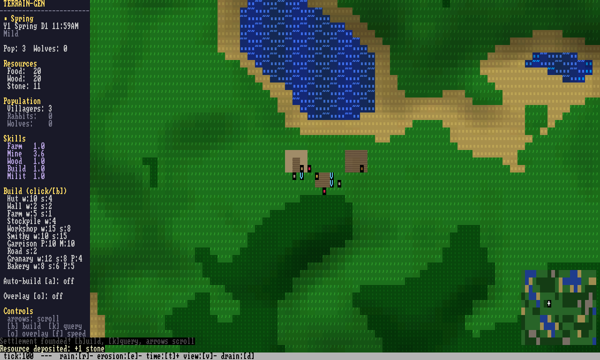
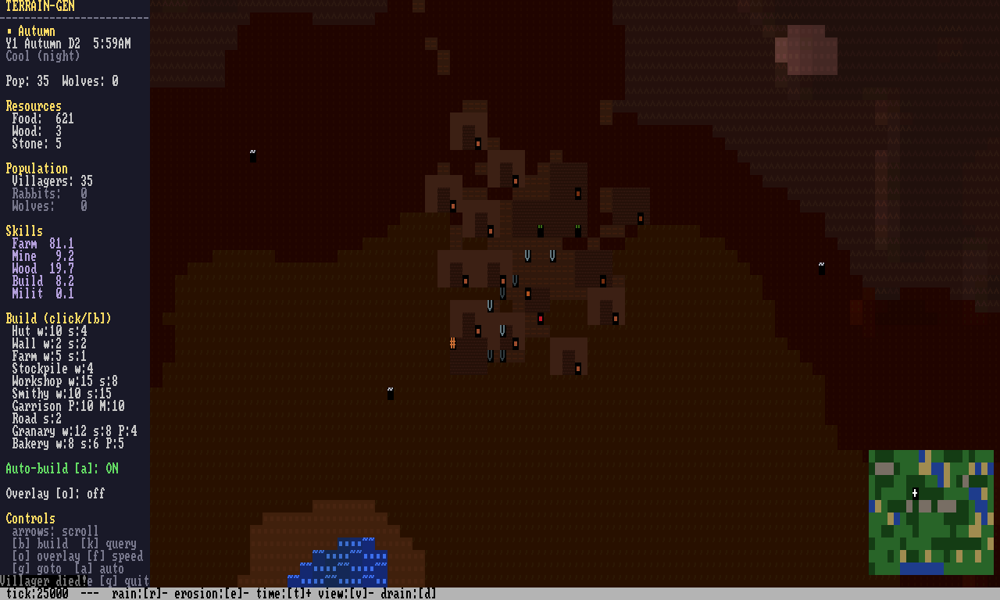

# terrain-gen-rust

A terminal-based settlement simulation game written in Rust. Watch an autonomous village grow, survive seasons, and interact with a procedurally generated world -- all rendered in your terminal.


## Quick Start

```bash
cargo run --release    # play the game
```

## Screenshots

| Spring | Autumn |
|--------|--------|
|  |  |

| Winter | Moonlit Night |
|--------|---------------|
|  |  |

| Coastal (seed 88) | Established Village |
|--------------------|---------------------|
|  |  |

Generate screenshots: `./scripts/screenshots.sh` (requires `--features png`)

## Design Philosophy

### The Ant Colony

Inspired by the space between Civilization and Banished, with Songs of Syx as a key reference. The core idea: **the player sets direction, and the systems execute.**

Your settlement is an ant colony. Villagers self-organize based on what's built and what's needed. The player's only verb is "place building." There are no manual work assignments, no priority sliders, no micromanagement. Fun comes from watching emergent behavior and making strategic decisions about *what* to build and *where*.

### Placement IS the Instruction

Every building is a signal to the AI:
- Place a **Farm** and villagers will tend it, plant crops, harvest food
- Place a **Workshop** and a villager will process Wood into Planks
- Place a **Garrison** and the settlement's defense rating rises, repelling wolf raids
- Place a **Hut** and the population can grow (births require housing surplus)

No "assign worker" buttons. Villagers read the settlement state -- what's scarce, what's nearby, what's been built -- and pick the most useful task.

### Observability Over Control

Instead of complex UI panels, the game uses **overlay modes** (`o` key) to visualize systems:
- **Tasks**: color-codes villagers by activity (farming=green, building=yellow, fleeing=red)
- **Resources**: highlights food sources, stone deposits, stockpiles
- **Threats**: wolf positions, den danger zones, garrison defense coverage
- **Traffic**: heat map of foot traffic (high traffic auto-builds roads!)
- **Territory**: settlement influence borders

## How the Systems Work

### Villager AI

Each tick, villagers use priority-based task selection:

1. **Flee** if wolves nearby and settlement undefended (gives up after 120 ticks)
2. **Sleep** at night in nearest hut
3. **Eat** from stockpile or berry bush when hungry
4. **Work** at assigned processing building
5. **Farm** at assigned farm plot
6. **Build** nearest construction site
7. **Haul** gathered resources to stockpile
8. **Gather** nearest resource (prioritized by scarcity -- low food = gather food first)
9. **Wander** if nothing else to do

Villagers use **A* pathfinding** to navigate around mountains, water, and buildings. Different terrain has different movement costs (roads are fast, mountains are very slow).

### Economy & Production Chains

```
Wood  -> Workshop -> Planks         (2 wood = 1 plank)
Stone -> Smithy   -> Masonry        (2 stone = 1 masonry)
Food  -> Granary  -> Grain          (3 food = 2 grain, preserved in winter)
Grain + Wood -> Bakery -> Bread     (2 grain + 1 wood = 3 bread)
```

| Building   | Cost        | Function                        |
|------------|-------------|---------------------------------|
| Farm       | 5w 1s       | Grows food, villagers tend it   |
| Hut        | 10w 4s      | Housing, villagers sleep here   |
| Wall       | 2w 2s       | Defensive barrier               |
| Workshop   | 8w 3s       | Wood -> Planks                  |
| Smithy     | 5w 8s       | Stone -> Masonry                |
| Granary    | 6w 4s       | Food -> Grain (winter-safe)     |
| Bakery     | 8w 4s 2p    | Grain + Wood -> Bread, prevents plague |
| Garrison   | 4w 6s 2m    | Defends against wolf raids      |

Garrison requires Planks + Masonry, creating a natural tech tree: you need Workshop + Smithy before you can build defenses.

### Terrain & Movement

| Terrain       | Speed | A* Cost | Notes |
|---------------|-------|---------|-------|
| Road          | 1.5x  | 0.7     | Auto-built from foot traffic |
| Grass/Floor   | 1.0x  | 1.0     | Normal terrain |
| Sand          | 0.8x  | 1.3     | Coastal areas |
| Forest        | 0.6x  | 1.7     | Slower, source of wood |
| Snow          | 0.4x  | 2.5     | High altitude |
| Mountain      | 0.25x | 4.0     | Very slow but passable |
| Water         | --    | --      | Impassable |

### Seasons & Events

A full day/night cycle with seasons (10-day seasons, 1200 ticks/day):

| Season | Effects |
|--------|---------|
| **Spring** | High vegetation growth, rain, migration events (new villagers) |
| **Summer** | Peak food, fast farm growth, drought risk |
| **Autumn** | Vegetation decays, warm orange-brown tint, bountiful harvest chance |
| **Winter** | No growth, 2.5x hunger, food spoilage (grain preserved), wolf surges |

**Random events**: Drought, Bountiful Harvest, Wolf Surge, Plague (year 2+), Blizzard, Bandit Raids (year 3+). Events are self-resolving -- the player prepares (or doesn't) by what they built.

**Milestones**: First Winter, 10 Villagers, First Garrison, 5 Years, 20 Villagers -- each increases threat level.

### Traffic & Roads

Villager foot traffic is tracked per tile. When a tile accumulates 300+ steps, it auto-converts to a **Road** (1.5x speed). This creates organic road networks -- no manual road placement needed.

### Fog of Exploration

The map starts dark. Only tiles within villager sight range are revealed. As villagers explore and expand, the visible area grows. Unexplored tiles render as dark fog.

## Controls

| Key | Action | Key | Action |
|-----|--------|-----|--------|
| Arrows | Scroll camera | `b` | Toggle build mode |
| `k` | Query/inspect tile | `o` | Cycle overlay |
| `f` | Cycle speed (1x/2x/5x) | `g` | Goto settlement |
| `a` | Toggle auto-build | `Space` | Pause |
| `q` (x2) | Quit | `s`/`l` | Save/Load |

**Build mode**: `wasd` move cursor, `tab` cycle type, `enter` place, `x` demolish

## Non-Interactive / AI Harness

```bash
# Headless play with scripted inputs
cargo run --release -- --play --ticks 500
cargo run --release -- --play --inputs "tick:100,input:ScrollDown,frame"

# PNG screenshots (requires --features png)
cargo run --release --features png -- --screenshot --png out.png --ticks 300 --seed 42

# Screenshot gallery
./scripts/screenshots.sh
```

The headless mode captures full frame data for AI training:
- `Game::step()` / `step_headless()` for single-tick advance
- `FrameSnapshot::diff()` for cell-level change detection
- JSON serialization via serde
- `GameInput` enum for programmatic control

## Lua Scripting (Optional)

```bash
cargo run --release --features lua    # enable Lua scripting
```

Feature-gated Lua integration via [mlua](https://crates.io/crates/mlua):
- `ScriptEngine` exposes game state (villager count, resources, season, wolf count)
- Hook points: `on_tick()`, `on_event()`
- Hot reload from `scripts/` directory
- Example scripts: `default_ai.lua`, `defend_first.lua`, `pacifist.lua`

## Architecture

```
src/
  main.rs                 -- Entry point, input mapping, --play/--screenshot modes
  lib.rs                  -- Crate root, re-exports
  renderer.rs             -- Renderer trait, Color, Cell types
  crossterm_renderer.rs   -- Terminal backend with double buffering
  headless_renderer.rs    -- In-memory renderer for testing/AI/PNG output
  tilemap.rs              -- Tile map, terrain types, A* pathfinding, camera
  terrain_gen.rs          -- Procedural terrain (Perlin fBm)
  simulation.rs           -- Water, erosion, vegetation, day/night, seasons, lighting
  scripting/              -- Lua integration (feature-gated)
  ecs/
    components.rs         -- All types: Position, Creature, BuildingType, etc.
    systems.rs            -- system_* functions (AI, movement, death, farms, raids)
    ai.rs                 -- Villager/predator/prey behavior with A* pathfinding
    spawn.rs              -- Entity spawn helpers
    serialize.rs          -- World serialization for save/load
  game/
    mod.rs                -- Game struct, step() main loop, ~194 unit tests
    render.rs             -- Panel, terrain, overlays, minimap, weather effects
    events.rs             -- Random events, milestones, difficulty scaling
    save.rs               -- Save/load to JSON
    build.rs              -- Building placement, auto-build, demolish, traffic
```

## Testing

```bash
cargo test --lib         # fast: ~194 unit tests (~7s)
cargo test               # full: + integration tests (~60s)
cargo test --features lua  # with Lua scripting tests
```

## Dependencies

- **hecs** -- ECS
- **crossterm** -- Terminal rendering
- **noise** -- Perlin noise terrain generation
- **rand** -- RNG
- **serde / serde_json** -- Serialization
- **anyhow** -- Error handling
- **image** + **font8x8** -- PNG screenshot rendering (optional, `--features png`)
- **mlua** -- Lua scripting (optional, `--features lua`)
